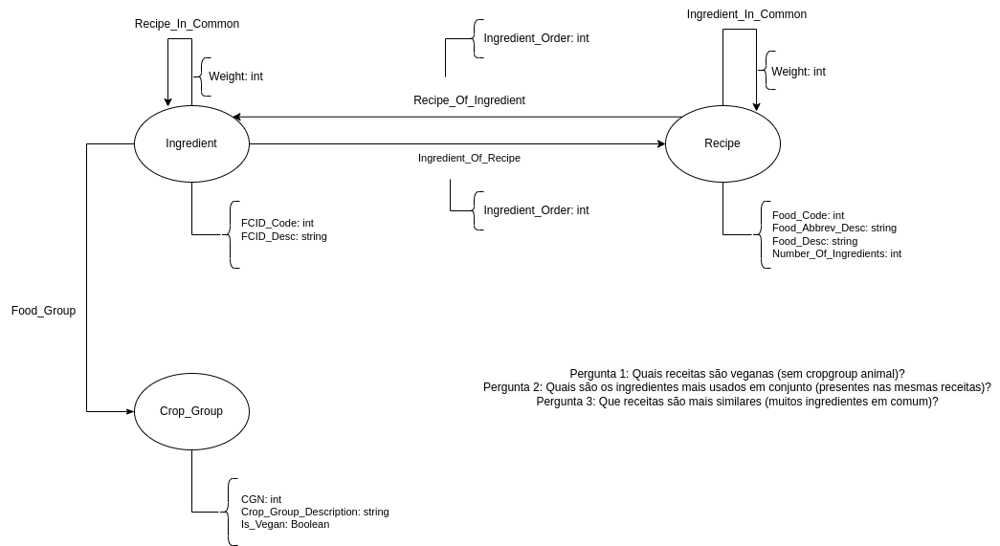

## Lab07 - Modelagem em banco de grafos

## Equipe: VIRUS

## Subgrupo: A  (BOYS)

- Lucas Gabriel Monteiro Da Costa - 183967 
- Pietro Grazzioli Golfeto - 223694 
- Vitor Rodrigues Zanata da Silva - 231718

### Modelo lógico do banco de dados de grafo

### Perguntas de pesquisa/análise

Pergunta 1: Quais receitas são veganas (sem cropgroup animal)?
Pergunta 2: Quais são os ingredientes mais usados em conjunto (presentes nas mesmas receitas)?
Pergunta 3: Que receitas são mais similares (muitos ingredientes em comum)?

### Implementação do grupo para o modelo lógico

~~~cypher
    LOAD CSV WITH HEADERS FROM "https://raw.githubusercontent.com/santanche/lab2learn/master/data/food-intake/basics/Food_Code_Description.csv" AS line
    CREATE (:Recipe {Food_Code: line.Food_Code, Food_Desc: line.Food_Desc})
    
    CREATE INDEX FOR (f:Recipe) on (f.Food_Code)
    
    LOAD CSV WITH HEADERS FROM "https://raw.githubusercontent.com/santanche/lab2learn/master/data/food-intake/basics/FCID_Cropgroup_Description.csv" AS line
    #CG auxiliar
    CREATE (:CG {CGN: line.CGN, CGL: line.CGL, Description: line.Crop_Group_Description});
    
    
    MATCH (n:CG) WHERE (n.CGN=n.CGL)
    CREATE (:Crop_Group {CGN: n.CGN, Crop_Group_Description: n.Description, Is_Vegan: 0});
    
    MATCH (n:Crop_Group) WHERE toInteger(n.CGN)<25 OR toInteger(n.CGN)=86
    SET n.Is_Vegan = 1
    
    MATCH (k:CG) DELETE (k)
    
    CREATE INDEX FOR (cg:Crop_Group) on (cg.CGN)
    
    #Food_Group
    LOAD CSV WITH HEADERS FROM "https://raw.githubusercontent.com/santanche/lab2learn/master/data/food-intake/basics/FCID_Code_Description.csv" AS line
    CREATE (fcid:Ingredient {FCID_Code:line.FCID_Code, FCID_Desc:line.FCID_Desc, CGN: line.cgn})
    
    MATCH (fcid:Ingredient)
    MATCH (cg:Crop_Group {CGN: fcid.CGN})
    MERGE (fcid)-[f:Food_Group]->(cg)
    
    
    CREATE INDEX FOR (fcid:Ingredient) ON (fcid.FCID_Code)
    
    # Mod_Code = 0 -> Receitas que não são modificadas (i.e, ignora-se as receitas modificadas)
    #Recipes_Of_Ingredient/Ingredient_Of_Recipes
    LOAD CSV WITH HEADERS FROM "https://raw.githubusercontent.com/santanche/lab2learn/master/data/food-intake/recipes/Recipes_WWEIA_FCID_0510.csv" AS line
    
    MATCH (fcd:Recipe {Food_Code: line.Food_Code})
    MATCH (fcid:Ingredient {FCID_Code: line.FCID_Code})
    WHERE line.Mod_Code="0"
    
    MERGE (fcd)-[:Recipe_Of_Ingredient {Ingredient_Order: line.Ingredient_Num}]->(fcid)
    
    MERGE (fcid)-[:Ingredient_Of_Recipe {Ingredient_Order: line.Ingredient_Num}]->(fcd)
    
    #Number of ingredients in a recipe: MATCH(n1:Ingredient)-[t:Ingredient_Of_Recipe {Ingredient_Order: line.Ingredient_Num}]->(n2:Recipe) RETURN count(t)
    
    #Recipe_In_Common
    MATCH (d1:Ingredient)-[t1:Ingredient_Of_Recipe]->(d:Recipe)-[t2:Recipe_Of_Ingredient]->(d2:Ingredient)
    MERGE (d1)<-[ric:Recipe_In_Common]->(d2)
    ON CREATE SET ric.weight=1
    ON MATCH SET ric.weight=ric.weight+1
    
    #Ingredient_In_Common
    MATCH (d1:Recipe)-[t1:Recipe_Of_Ingredient]->(d:Ingredient)
    MATCH (d2:Recipe)-[t2:Recipe_Of_Ingredient]->(d) 
    WHERE d1.Food_Code <> d2.Food_Code
    MERGE (d1)<-[iic:Ingredient_In_Common]->(d2) 
    ON CREATE SET iic.weight=1 
    ON MATCH SET iic.weight=iic.weight+1

~~~
